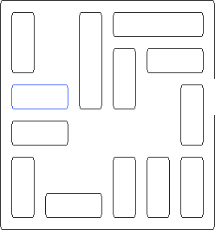
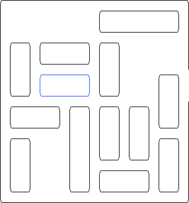
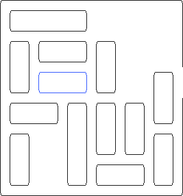

# Projet Rush Hour

Le but de ce projet est d'écrire un programme permettant de trouver une
solution au jeu *Rush Hour*.

## Règles du jeu

Le jeu Rush Hour se joue seul sur une grille carrée de six cases de côté. Sur
cette grille sont répartis des véhicules d'une case de largeur, et de deux ou
trois cases de longueur. Ces véhicules peuvent être placés horizontalement ou
verticalement. Chaque véhicule peut être déplacé en avant ou en arrière, mais
pas latéralement, tant qu'il n'entre pas en collision avec un autre véhicule.
Le but du jeu est de faire sortir l'un des véhicules par une sortie placée sur
le bord du plateau. L'image ci dessous illustre un exemple de partie.



Chaque déplacement de véhicule compte pour un coup, quelle que soit la longueur
du déplacement. La qualité de votre solution dépend donc du nombre de coups
nécessaires depuis la situation initiale pour faire sortir le véhicule.

## Modélisation

La recherche d'une solution au jeu Rush Hour peut être modélisée sous la forme
d'un parcours de graphe. Dans ce graphe, les sommets sont des situations de jeu.
Les arêtes sont des coups. Les deux images qui suivent représentent deux
situations de jeu, et donc deux sommets du graphe. Il est possible de passer
d'une situation à l'autre en déplaçant le long véhicule du haut, elles sont donc
reliées par une arête dans le graphe.


&nbsp;&nbsp;&nbsp;&nbsp;&nbsp;&nbsp;


Votre première tâche pour ce projet consiste à élaborer une structure de données
pour représenter les situations de jeu, munies de méthodes pour accéder de
façon pratique aux situations de jeu adjacentes.

Il ne s'agit pas ici de *construire le graphe complet* ni de le *stocker*, mais
simplement de pouvoir le *parcourir*.

Pour vous aider dans l'élaboration de votre structure de données, vous pourrez
utiliser le fait que :

* les véhicules ne sont que de taille deux ou trois
* il n'y a jamais plus de 16 véhicules
* il n'y a toujours qu'un véhicule à sortir

La situation initiale du problème résolu plus haut :


pourra être décrite par [le fichier suivant](Sujet/puzzle.txt) :

```
2 5
2 0 2 1
0 0 2 0
0 2 3 0
0 3 3 1
1 3 2 0
1 4 2 1
2 5 2 0
3 3 2 1
4 0 2 0
4 3 2 0
4 4 2 0
4 5 2 0
5 1 2 1
```
La première ligne correspond à la position de la sortie (ligne 2 colonne 5), la
seconde ligne est la position du véhicule à sortir (ligne 2, colonne 0, longueur
2, horizontal), les lignes suivantes sont les autres véhicules, toujours avec le
format ligne, colonne, longueur, horizontal (1) ou vertical (0). Dans le cas
d'un véhicule horizontale, la position donnée est celle de la case la plus à
gauche, dans le cas d'un véhicule vertical, la position donnée est celle de la
case la plus haute.

## Parcours

Une fois les situations de jeu représentables, il s'agit maintenant d'instancier
la situation de jeu initiale, et de parcourir le graphe pour trouver une
situation de jeu gagnante, ainsi que les coups permettant de l'atteindre.
Idéalement, le nombre de coups à jouer pour atteindre cette situation de jeu
gagnante devra être minimal. Dans le cas de l'exemple fourni ci-dessus, le code
de votre responsable d'UE a donné une solution en 14 coups.

Attention en particulier à faire en sorte que votre exploration n'étudie qu'une
fois chaque situation de jeu, et se rendre compte que certaines situations ont
déjà été explorées. Sans cette attention, votre exploration risquera de tourner
en rond entre des situations de jeu.

## Élaboration de nouveaux puzzles

Une fois la résolution programmée, et le parcours du graphe compris,
consacrez-vous à la création de nouveaux puzzles. Cette fois, il s'agit de
fournir une situation de départ qui soit intéressante à jouer. La difficulté du
puzzle correspondra au nombre de coups minimal pour le résoudre, et votre but
sera ici de trouver des stratégies pour créer les puzzles les plus difficiles
possibles.

## Conditions de rendu

Le travail est a réaliser autant que possible en binôme. Les monômes ne seront
acceptés qu'exceptionnellement, à discuter avec votre encadrant de TP. Les
membres du binôme devront être dans le même groupe de TP, et seront évalués par
leur encadrant de TP. Le travail doit être rendu pour la dernière séance de TP
de l'année qui aura lieu le mercredi 10 avril. Cette dernière séance de TP sera
intégralement dédiée à votre évaluation.

Vous devrez rendre votre travail sous la forme d'une archive `zip` ou `tar.gz`.
Si vous utilisez d'autres formats d'archives, vous le faites à vos risques et
périls. Dans cette archive, un fichier readme devra indiquer la procédure pour
compiler votre code si elle n'est pas standard, et le fonctionnement des
exécutables générés. Pour simplifier le travail de vos examinateurs, supposez
qu'ils sont incompétents dans l'utilisation de vos outils (cmake, codeblocks,
visual studio, ...). Fournissez une archive munie d'un `Makefile`. Si vous
utilisez des dépendances autres que la librairie standard, mentionnez les
clairement, et assurez vous qu'elle ne seront pas compliquées à installer.

Le code que vous rendrez devra être votre production propre. Si vous reprenez
des portions de code, quelle qu'en soit la source et la taille (vos camarades,
stackoverflow ou autre site d'entraide), vous devrez en mentionner la provenance
précise, faute de quoi votre travail sera considéré comme une fraude. Notez que
lors du rendu, l'ensemble des codes seront analysés par des outils permettant de
détecter des similarités, et qu'il ne suffit pas de renommer les variables pour
les berner.

Vous êtes autorisés à utilisé l'intégralité de la librairie standard, en
particulier les conteneurs (`vector`, `list`, `stack`, `queue`,
`priority_queue`, `set`, `map`, `unordered_set`, `unordered_map`, ...) et les
algorithmes (`sort`, `shuffle`, `binary_search`, ...).

## Évaluation

L'évaluation se passera en deux temps, un oral, puis une relecture de votre
travail.

### Oral

Le jour du rendu, en séance avec votre encadrant, il vous fournira un horaire de
passage pour un oral de démonstration.  Pendant cet oral, vous ferez brièvement
la démonstration de vos résultats, puis vous serez interrogés sur le code que
vous avez rendu. Votre correcteur aura ici plusieurs objectifs :

* déterminer à quel point vous avez compris le sujet
* déterminer jusqu'où vous avez abordé le sujet
* déterminer si vous êtes capables de commenter vos choix et de les analyser
* déterminer si vous êtes bien l'auteur du code rendu
* déterminer si les contributions dans le binôme sont équilibrées

### Relecture

La relecture de votre code sera ensuite faite sans vous. Chaque correcteur sera
muni d'une grille pour évaluer les points suivants :

* votre code compile facilement
* les exécutables, lancés selon les instructions du readme, sont fonctionnels
* les exécutables permettent de tester l'intégralité de votre code
* les exécutables permettent de tester les points d'évaluation qui suivent
* le programme permet de charger une situation de jeu initiale
* le programme permet de trouver une solution 
* la solution trouvée est la plus courte
* le parcours de graphe est réalisé correctement
* les structures de données sont pertinentes en terme d'espace mémoire
* les fonctions et méthodes sont pertinentes en terme d'espace et de complexité
* la gestion de la mémoire est propre et sans fuites
  * un outil de détection de type valgrind a été utilisé pour s'en assurer
  * si des problèmes persistent, ils sont identifiés dans le readme
  * les problèmes sont mentionnés lors de l'oral et discutés
* le code est clair et bien structuré
  * nommage clair des fonctions et variables
  * bon découpage des fonctions pour éviter la duplication de code
  * pas de fonctions trop longues
  * pas de lignes de code trop longues
  * indentation claire

Il est toujours difficile de donner un barème précis a priori, sans se bloquer
ensuite la possibilité de pouvoir adapter la notation en fonction des travaux
rendus et de la difficulté perçue du sujet. Il est néanmoins possible d'affirmer
que pour obtenir la moyenne, il sera nécessaire d'avoir au moins abordé la
partie résolution.
